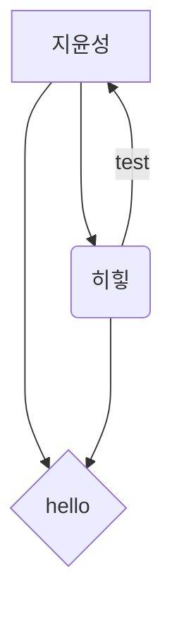
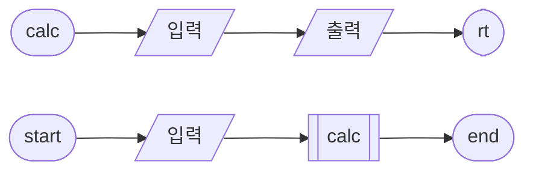

# Project01
리파지토리 연습 &amp; git hub 작동 방식 테스트

```mermaid
flowchart TB
    A[지윤성]
    B(히힣)
    A ---> B
    B --test--> A
    A --> C{hello}
    B ---> C
```

```mermaid
flowchart LR
    calc([calc])
    calc --> inp[/입력/]
    inp --> out[/출력/]
    out --> rt([rt])

    start([start]) --> inp1[/입력/]
    inp1 --> fun1[[calc]]
    fun1 --> end1([end])
```